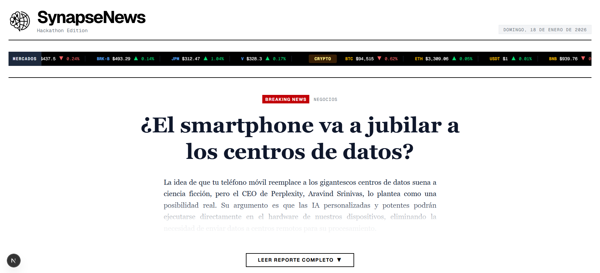
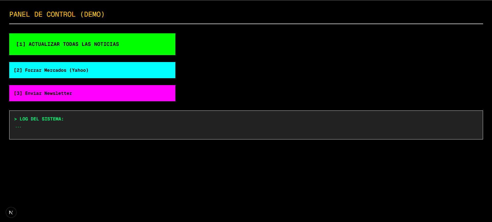
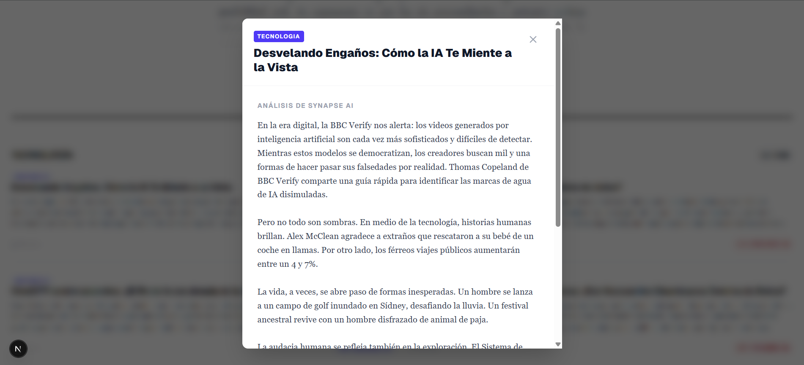
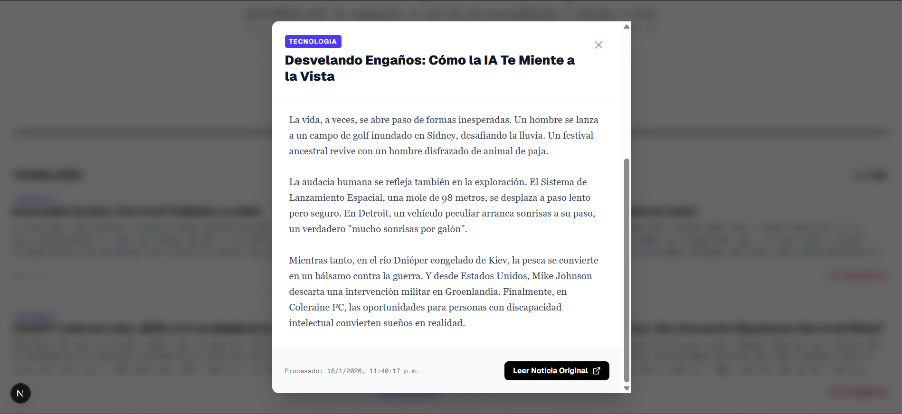
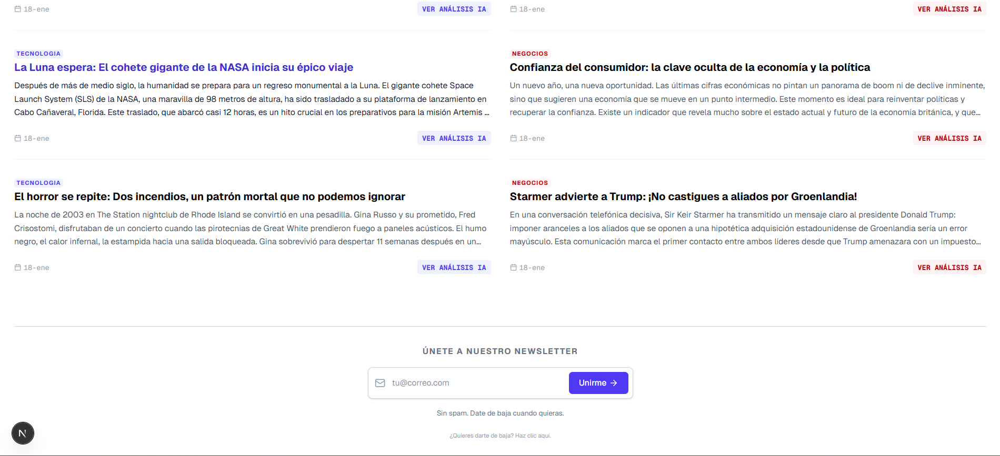
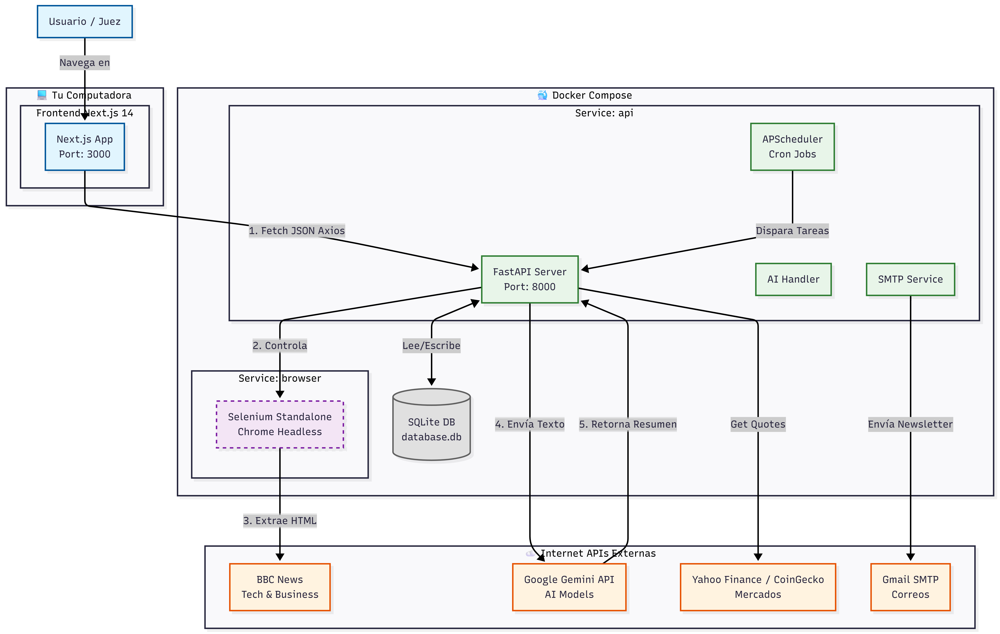

# 🧠 SynapseNews

> **Plataforma de Inteligencia de Mercado y Noticias en Tiempo Real impulsada por GenAI.**



## 👨‍💻 Sobre el Proyecto

**Desarrollado por:** Luis Enrique Tadeo Sandoval Santos
**Contexto:** Proyecto de Hackathon

Diseñé y construí **SynapseNews** con un objetivo claro: demostrar cómo la integración de agentes de IA y scraping avanzado puede democratizar el acceso a información financiera de alto nivel. **Yo desarrollé** toda la arquitectura full-stack en tiempo récord.

---

## ⚡ Accesos Rápidos (Quick Links)

| Componente | URL | Descripción |
|------------|-----|-------------|
| **🖥️ Frontend** | [http://localhost:3000](http://localhost:3000) | Interfaz de Usuario (Next.js). |
| **🕹️ Panel de Demo** | [http://localhost:3000/demo](http://localhost:3000/demo) | **¡JUECES: USAR ESTO!** Panel para forzar actualizaciones manuales. |
| **📚 API Docs** | [http://localhost:8000/docs](http://localhost:8000/docs) | Documentación Swagger del Backend. |
| **🤖 Selenium** | [http://localhost:4444](http://localhost:4444) | Visor del navegador de scraping. |

---

## 📸 Demo Visual

### 1. Panel de Control Manual (Ruta `/demo`)
Para la demostración en vivo, implementé un control manual para disparar los eventos.


### 2. Análisis de IA (Gemini)
El sistema lee noticias crudas y genera resúmenes.



### 3. Newsletter 
El sistema cuenta con un sistema de newsletter para que las noticias lleguen todos los dias a las 8 de la mañana.


---

## 🚀 Stack Tecnológico

* **Frontend:** Next.js 16, React 19, TailwindCSS.
* **Backend:** FastAPI (Python), SQLModel.
* **IA & Data:** Google Gemini, Selenium WebDriver, EODHD API.
* **Infraestructura:** Docker Compose (Backend) + Node.js (Frontend).

---

## 🛠️ Instalación y Ejecución

El sistema corre en un entorno híbrido para facilitar el desarrollo. Sigue estos 2 pasos:

### PASO 1: Levantar el Backend (Docker)

La lógica pesada (IA, Scraping, BD) corre en contenedores.

1.  Ve a la carpeta `backend/` y crea un archivo `.env` con tus claves:
    ```env
    # backend/.env
    SELENIUM_URL=http://browser:4444/wd/hub
    DATABASE_URL=sqlite:///./data/database.db

    # TUS CLAVES (Reemplazar)
    GEMINI_API_KEYS=TU_CLAVE_GEMINI_1,TU_CLAVE_GEMINI_2
    EODHD_API_KEY=TU_CLAVE_EODHD
    TOP_STOCK_SYMBOLS=AAPL,MSFT,GOOGL,AMZN,META,NVDA,TSLA,BRK-B,JPM,V

    # CORREO
    SMTP_SERVER=smtp.gmail.com
    SMTP_PORT=587
    SMTP_USER=tucorreo@gmail.com
    SMTP_PASSWORD=tu_password_app
    ```

2.  Desde la raíz del proyecto, levanta los contenedores:
    ```bash
    docker-compose up --build
    ```
    *(Espera a que veas los logs de Uvicorn indicando que la API está lista en el puerto 8000)*

### PASO 2: Levantar el Frontend (Local)

La interfaz gráfica corre directamente en tu máquina con Node.js.

1.  Abre **otra terminal**.
2.  Ve a la carpeta `frontend/` y crea el archivo `.env.local`:
    ```env
    # frontend/.env.local
    NEXT_PUBLIC_API_URL=http://localhost:8000
    ```
3.  Instala dependencias e inicia:
    ```bash
    cd frontend
    npm install
    npm run dev
    ```

**¡Listo!** Abre tu navegador en **http://localhost:3000**.

---

## 🏛️ Arquitectura del Sistema

1.  **Frontend (Next.js):** Consulta la API para mostrar datos frescos.
2.  **Backend (FastAPI):**
    * Gestiona la Base de Datos SQLite.
    * Orquesta los trabajos en segundo plano.
3.  **Browser (Selenium):** Contenedor dedicado que navega por internet extrayendo noticias.
4.  **IA (Gemini):** Procesa el texto extraído para generar inteligencia.

